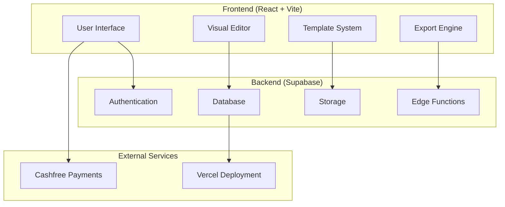

# WebForge Design Document

## Overview

WebForge is a modern web builder application built with React 18, TypeScript, and Supabase. The system follows a component-based architecture with a drag-and-drop visual editor, real-time preview capabilities, and cloud-based project management. The application uses a subscription-based model with Cashfree payment integration.

## Architecture

### High-Level Architecture



### Frontend Architecture

The frontend follows a modular React architecture with:

- **Component Library**: Reusable UI components built with Tailwind CSS
- **State Management**: React Context API for global state, local state for component-specific data
- **Routing**: React Router for navigation between pages
- **Build System**: Vite for fast development and optimized production builds

### Backend Architecture

Supabase provides the complete backend infrastructure:

- **Authentication**: Built-in user management with JWT tokens
- **Database**: PostgreSQL with Row Level Security (RLS)
- **Storage**: File storage for user projects and assets
- **Edge Functions**: Serverless functions for payment processing and exports

## Components and Interfaces

### Core Components

#### 1. Authentication System
- **LoginForm**: User login interface
- **RegisterForm**: User registration interface  
- **AuthProvider**: Context provider for authentication state
- **ProtectedRoute**: Route wrapper for authenticated pages

#### 2. Visual Editor
- **EditorCanvas**: Main editing surface with drag-and-drop functionality
- **ComponentPalette**: Sidebar with draggable elements
- **PropertyPanel**: Right sidebar for editing selected element properties
- **ViewportSwitcher**: Controls for switching between desktop/tablet/mobile views
- **PreviewMode**: Real-time preview of the website being built

#### 3. Project Management
- **ProjectDashboard**: Overview of user's projects
- **ProjectCard**: Individual project preview and actions
- **ProjectSettings**: Project configuration and metadata
- **TemplateGallery**: Browse and select from available templates

#### 4. Subscription System
- **PricingPlans**: Display available subscription tiers
- **PaymentForm**: Integration with Cashfree payment gateway
- **SubscriptionStatus**: Current plan display and upgrade options
- **UsageLimits**: Track and display current usage against plan limits

#### 5. Export System
- **ExportDialog**: Options for exporting projects
- **CodeGenerator**: Converts visual elements to clean HTML/CSS/JS
- **DownloadManager**: Handles ZIP file generation and download

### API Interfaces

#### Supabase Database Schema

```sql
-- Users table (handled by Supabase Auth)
-- Additional user profile data
CREATE TABLE user_profiles (
  id UUID REFERENCES auth.users PRIMARY KEY,
  subscription_plan TEXT DEFAULT 'free',
  subscription_expires_at TIMESTAMP,
  created_at TIMESTAMP DEFAULT NOW(),
  updated_at TIMESTAMP DEFAULT NOW()
);

-- Projects table
CREATE TABLE projects (
  id UUID PRIMARY KEY DEFAULT gen_random_uuid(),
  user_id UUID REFERENCES auth.users,
  name TEXT NOT NULL,
  description TEXT,
  template_id TEXT,
  data JSONB NOT NULL,
  created_at TIMESTAMP DEFAULT NOW(),
  updated_at TIMESTAMP DEFAULT NOW()
);

-- Pages table
CREATE TABLE pages (
  id UUID PRIMARY KEY DEFAULT gen_random_uuid(),
  project_id UUID REFERENCES projects,
  name TEXT NOT NULL,
  slug TEXT NOT NULL,
  data JSONB NOT NULL,
  created_at TIMESTAMP DEFAULT NOW(),
  updated_at TIMESTAMP DEFAULT NOW()
);

-- Subscription transactions
CREATE TABLE subscription_transactions (
  id UUID PRIMARY KEY DEFAULT gen_random_uuid(),
  user_id UUID REFERENCES auth.users,
  plan_type TEXT NOT NULL,
  amount DECIMAL NOT NULL,
  currency TEXT DEFAULT 'INR',
  payment_id TEXT,
  status TEXT DEFAULT 'pending',
  created_at TIMESTAMP DEFAULT NOW()
);
```

#### Edge Functions

1. **Payment Processing Function**
   - Handles Cashfree webhook events
   - Updates user subscription status
   - Manages payment confirmations

2. **Export Function**
   - Generates clean HTML/CSS/JS from project data
   - Creates downloadable ZIP files
   - Optimizes code for production

## Data Models

### Project Data Structure

```typescript
interface Project {
  id: string;
  userId: string;
  name: string;
  description?: string;
  templateId?: string;
  pages: Page[];
  settings: ProjectSettings;
  createdAt: Date;
  updatedAt: Date;
}

interface Page {
  id: string;
  projectId: string;
  name: string;
  slug: string;
  elements: Element[];
  styles: PageStyles;
  seoSettings: SEOSettings;
}

interface Element {
  id: string;
  type: 'text' | 'image' | 'button' | 'container' | 'form';
  position: Position;
  styles: ElementStyles;
  content: any;
  children?: Element[];
}

interface Position {
  x: number;
  y: number;
  width: number;
  height: number;
}
```

### User Subscription Model

```typescript
interface UserProfile {
  id: string;
  subscriptionPlan: 'free' | 'pro' | 'business';
  subscriptionExpiresAt?: Date;
  usage: {
    projectCount: number;
    totalPages: number;
  };
  limits: {
    maxProjects: number;
    maxPagesPerProject: number;
  };
}
```

## Error Handling

### Frontend Error Handling

1. **Global Error Boundary**: Catches and displays React component errors
2. **API Error Handling**: Centralized error handling for Supabase operations
3. **Form Validation**: Real-time validation with user-friendly error messages
4. **Network Error Recovery**: Retry mechanisms for failed requests

### Backend Error Handling

1. **Database Constraints**: Proper foreign key relationships and data validation
2. **Row Level Security**: Ensures users can only access their own data
3. **Rate Limiting**: Prevents abuse of API endpoints
4. **Payment Error Handling**: Proper handling of failed payments and webhooks

### Error Recovery Strategies

- **Auto-save**: Prevent data loss during editing sessions
- **Offline Support**: Basic offline functionality with sync when reconnected
- **Graceful Degradation**: Core functionality remains available during partial failures
- **User Feedback**: Clear error messages with actionable next steps

## Testing Strategy

### Frontend Testing

1. **Unit Tests**: Component testing with React Testing Library
2. **Integration Tests**: User flow testing with Cypress
3. **Visual Regression Tests**: Screenshot comparison for UI consistency
4. **Accessibility Tests**: Automated a11y testing with axe-core

### Backend Testing

1. **Database Tests**: Schema validation and constraint testing
2. **Edge Function Tests**: Unit tests for serverless functions
3. **API Integration Tests**: End-to-end API workflow testing
4. **Payment Flow Tests**: Mock payment gateway testing

### Performance Testing

1. **Load Testing**: Simulate concurrent users building websites
2. **Bundle Size Monitoring**: Track and optimize frontend bundle size
3. **Database Performance**: Query optimization and indexing
4. **Export Performance**: Test large project export times

## Security Considerations

### Authentication & Authorization

- JWT token-based authentication via Supabase
- Row Level Security (RLS) policies for data access
- Secure session management with automatic token refresh

### Data Protection

- HTTPS enforcement for all communications
- Input sanitization and validation
- XSS protection in user-generated content
- CSRF protection for state-changing operations

### Payment Security

- PCI DSS compliance through Cashfree integration
- No storage of sensitive payment information
- Webhook signature verification for payment events

## Performance Optimization

### Frontend Optimization

- Code splitting and lazy loading for reduced initial bundle size
- Image optimization and lazy loading
- Virtual scrolling for large component lists
- Debounced auto-save to reduce API calls

### Backend Optimization

- Database indexing for frequently queried fields
- Connection pooling for database efficiency
- CDN integration for static asset delivery
- Caching strategies for template and user data

### Real-time Features

- WebSocket connections for collaborative editing (future enhancement)
- Optimistic updates for immediate user feedback
- Efficient diff algorithms for change detection